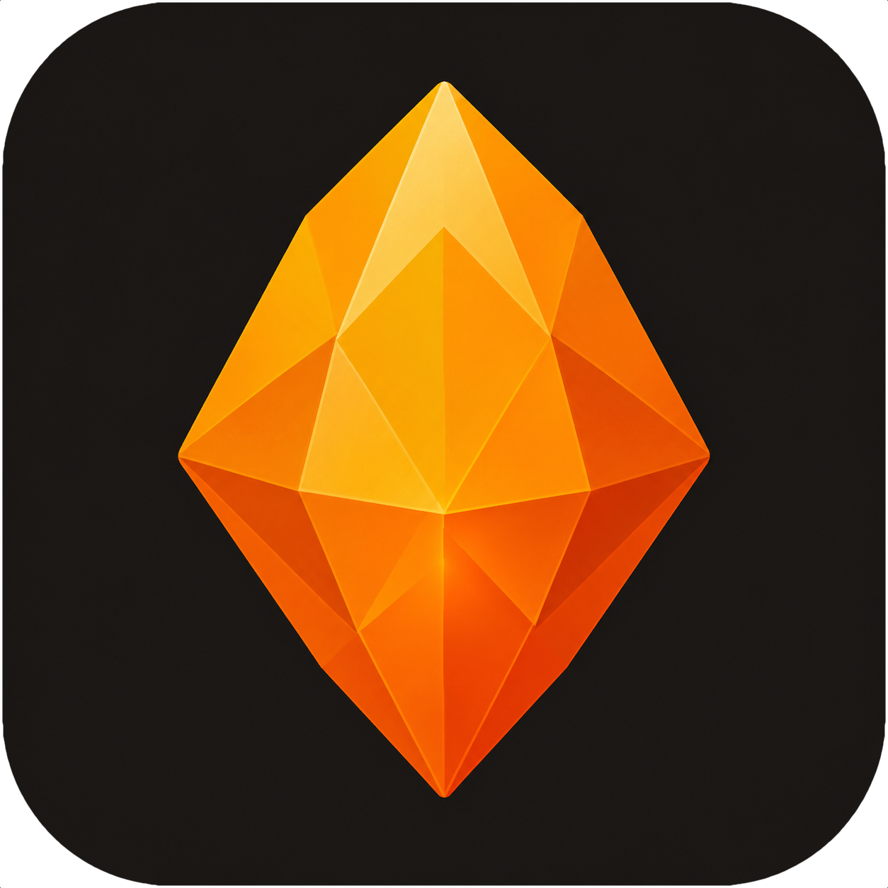

<p align="center">
  
</p>

<h1 align="center">Opal</h1>

<p align="center">High-performance image processing for PHP, backed by libvips via FFI</p>

<p align="center">
  <a href="https://packagist.org/packages/phpmlkit/opal"></a>
  <a href="https://github.com/phpmlkit/opal/actions"></a>
  <a href="https://packagist.org/packages/phpmlkit/opal"></a>
  <a href="LICENSE"></a>
</p>

## Features

- **Blazing Fast** — 5–10× faster than GD, 50–105× faster than Imagick
- **Lazy Pipelines** — operations are queued and optimised; executed only on save or export
- **Immutable API** — every transform returns a new `Image`, no side effects
- **NDArray Integration** — seamless interoperability with `phpmlkit/ndarray` for ML workflows
- **Drawing & Compositing** — rectangles, circles, text, overlays with blend modes
- **8 Resampling Kernels** — Nearest, Linear, Cubic, Mitchell, Lanczos2, Lanczos3, Mks211, Mks213
- **8 Colour Spaces** — RGB, RGBA, BGR, BGRA, Grayscale, Lab, HSV, CMYK
- **8 Image Formats** — JPEG, PNG, WebP, AVIF, TIFF, HEIF, BMP, GIF
- **Type-Safe** — PHP 8.2+ with strict types, enums, and immutable value objects

## Installation

```bash
composer require phpmlkit/opal
```

**Requirements:** PHP 8.2+, `ext-ffi`

## Quick Start

```php
use PhpMlKit\Opal\Image;

// Load an image
$image = Image::fromFile('photo.jpg');

// Chain transforms (nothing executes until you save or export)
$result = $image
    ->resize(1200, 800)
    ->sharpen()
    ->toGrayscale();

// Save
$result->toFile('output.jpg');

// Export as NDArray for ML pipelines
$tensor = $result->toArray();  // [H, W, C] TensorFlow format
```

## Performance

**Load → resize → rotate 45° → sharpen** (full pipeline):

| Image | GD | Imagick | Opal |
|---|---|---|---|
| 640×480 | 8.48 ms | 128.55 ms | **1.56 ms** |
| 1920×1080 | 49.67 ms | 721.97 ms | **5.36 ms** |
| 4000×2670 | 152.74 ms | 2,039.15 ms | **15.47 ms** |
| 6000×4000 | 299.43 ms | 3,538.47 ms | **33.17 ms** |

*Apple M1, macOS. Run: `php benchmarks/opal-vs-gd-vs-imagick.php`*

## Documentation

- [Full Documentation](https://phpmlkit.github.io/opal/)
- [What is Opal?](https://phpmlkit.github.io/opal/guide/getting-started/what-is-opal)
- [Quick Start](https://phpmlkit.github.io/opal/guide/getting-started/quick-start)
- [API Reference](https://phpmlkit.github.io/opal/api/)
- [Installation](https://phpmlkit.github.io/opal/guide/getting-started/installation)

## Development

```bash
# Install dependencies (downloads libvips binary)
composer install

# Run tests
composer test

# Run static analysis
composer lint

# Format code
composer cs:fix
```

## License

MIT License — see [LICENSE](LICENSE) file for details.

## Credits

Created by [Kyrian Obikwelu](https://github.com/KyrianObikwelu)

Powered by [libvips](https://www.libvips.org) and [phpmlkit/ndarray](https://github.com/phpmlkit/ndarray)

---

⭐ **Star this repo if you find it helpful!**
